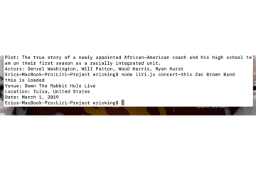
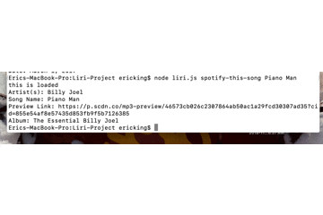

# Liri Bot

### Overview
The Liri Bot is an application that allows users to query information about movies, songs, and tour information for performing artists. The application gathers this information from the OMDB API for movies, the bands-in-town API for musical artists, and the Spotify API for information on songs. The axios package is used to send these requests for data [Axios](https://www.npmjs.com/package/axios). The Liri Bot is a .js file that is used along with node. Users can enter commands and are shown information in the terminal window.

### Use
1. To use the liri-bot the user must first navigate to the directory that the bot is stored with the terminal. Once they are inside that particular directory they can call the liri-bot with node. 

2. The user can give the bot 4 different commands.

    -movie-this (Movie Name)
    
    -concert-this (Artist/Band Name)
    
    -spotify-this-song (Song-Name)
    
    -do-what-it-says
        -- In the do-what-it-says command the bot reads in a random.txt file and runs the corresponding function for whatever command and search item is stored in that file.
    
    ### Examples
    
    
    
    
     
     
     
    
    
    
    
